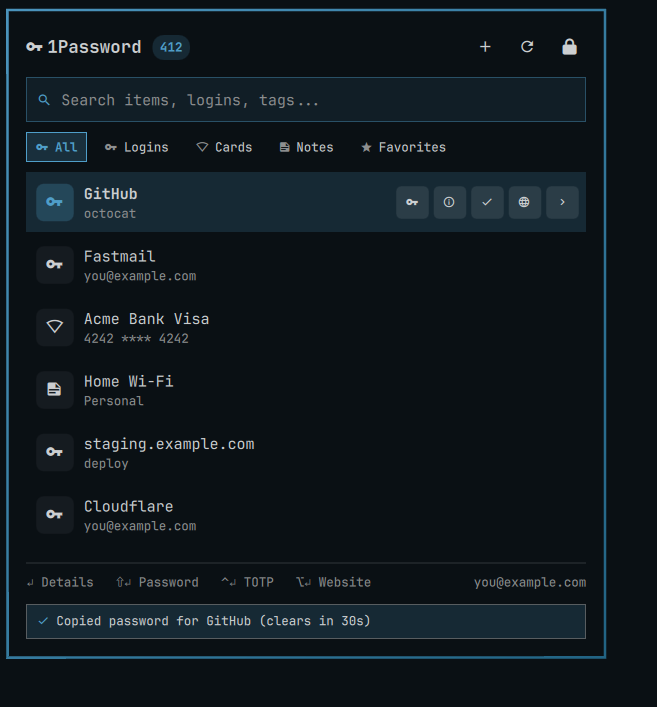
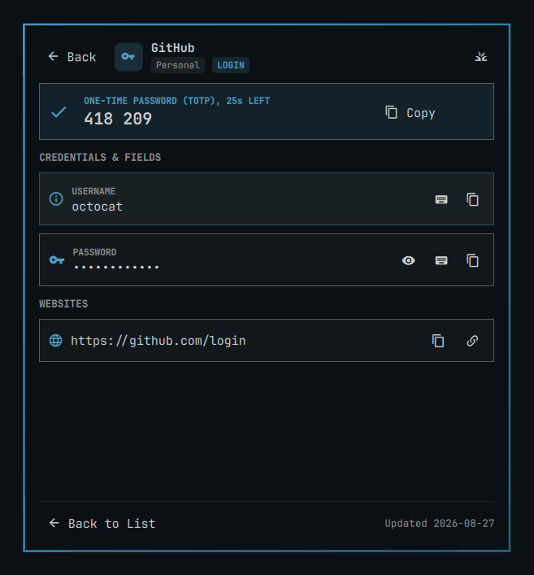
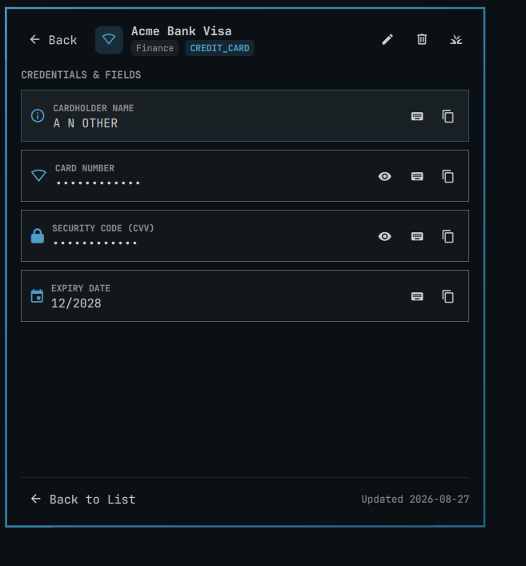
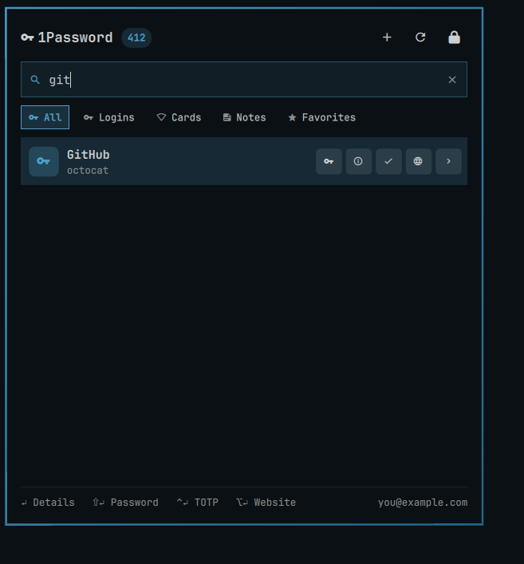
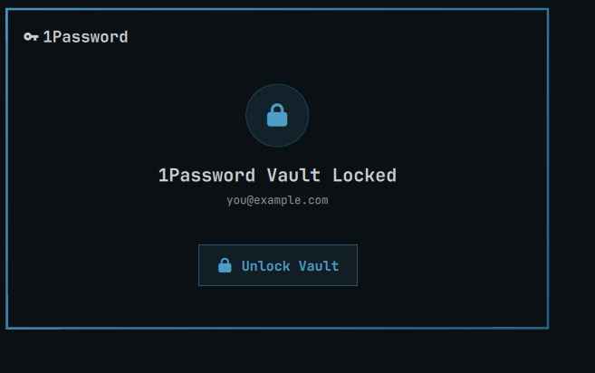

# OmaPass 󰌆

**OmaPass** is a native, ultra-responsive [Omarchy](https://omarchy.org/) status bar widget and instant vault launcher for [1Password](https://1password.com/).

Built natively with Quickshell, Qt Quick/QML, and Python, OmaPass integrates directly into your Hyprland bar and desktop theme with sub-millisecond search, biometric unlock, and zero Electron bloat.



## Features

- ⚡ **Instant Access**: Lives directly inside `omarchy-shell` / Wayland layer-shell without heavy Electron overhead.
- 󰌆 **Category-aware actions**: a credit card has no password, username or TOTP, so it is offered its card number, cardholder and CVV instead. The row buttons, the <kbd>Enter</kbd> chords and the footer hint all follow the highlighted item.
- 󰓎 **Fast In-Memory Search**: Substring and subsequence ("gthb" finds "GitHub") matching across titles, usernames, URLs, and vaults as you type.
- 󰤯 **Category Filtering**: Quick filter chips for *Logins*, *Credit Cards*, *Secure Notes*, and *Favorites*.
- 󰌏 **Biometric unlock**: authorization goes through the desktop app's CLI integration, so unlocking is the same fingerprint prompt as the app itself.
- 🎨 **Unified Omarchy Theming**: Automatically inherits your Omarchy colors, borders, font family, and blur.
- 🛡️ **Secret Isolation**: Decrypted secrets are fetched on demand, held in the helper's memory for at most 90 seconds, and piped straight to `wl-copy`. Every copy is wiped from the clipboard after `clipboardTimeout` seconds.

## A look around

| | |
| --- | --- |
|  |  |
| Details, with the one-time password counting down to its next window and every field one key away. | Cards get their own actions: number, cardholder, security code. There is no password to offer, so none is shown. |
|  |  |
| Substring and subsequence search over titles, usernames, URLs and vaults. | Locked, until you say otherwise. |

## Creating a login

```bash
./omapass-agent.py new "GitHub" --username octocat --url github.com
```

The password is produced by `op --generate-password` and stored directly in
the vault. OmaPass never sees it, so it cannot leak one it does not hold.
Title, username and URL are not secrets but are still your data, so they reach
`op` in a 0600 template file rather than in a command line every process on
the machine can read. Add `--dry-run` to have `op` validate without creating
anything.

From the widget, three ways in, all the same form:

- Search for something that is not there. The empty state offers to create it,
  with your query as the title, rather than being a dead end.
- The **+** in the header.
- `omarchy-shell gg.omapass new_login "GitHub"`, so it can go on a key.

The form is built from a spec in `Model.js`, one entry per category, and each
field picks its widget from 1Password's own field type. Adding a category is a
spec entry, not new QML.

Typing your own password is supported and says so on the form. It is worth
knowing what that costs: a generated password never exists outside 1Password,
while one you type reaches `op` through a mode-0600 file in `$XDG_RUNTIME_DIR`,
which is tmpfs, deleted as soon as the command returns. That is far better than
a command line, which every process on the machine can read, but it is not
nothing. Generated is the default for that reason.

## Editing and removing

From an item's details: **e** or the pencil to edit, **Del** or the bin to move
it to the 1Password archive. Archiving is what the bin does, not deleting: it
is recoverable from the app, and it asks first with **Keep** selected, so
Enter on the confirmation keeps the item.

The edit form shows the same fields the create form does, and the save names
only the fields you actually changed. Nothing else about the item is sent, so
sections, custom fields, passkeys and anything this plugin does not model are
never in a position to be rewritten. Changing a title cannot touch a password,
and a password rotated in the app since you opened the form is not pushed back
to the stale copy on screen.

That comes from a deliberate choice between op's two ways of editing, which
trade against each other:

- A JSON template keeps values out of the command line, but 1Password
  documents that a template does not carry passkeys and **overwrites the
  passkey** when it writes. Its JSON does not reliably say which items carry
  one, so this cannot be guarded against from outside.
- An assignment statement names one field and leaves the rest alone, but
  1Password warns that command arguments are visible to other processes on
  your machine.

OmaPass edits with assignment statements. A destroyed passkey is silent and
permanent; the argument window is bounded, documented, and lasts as long as
one `op` invocation. Rotating a password goes through `--generate-password`,
so the common case puts no secret in an argument at all. A password you type
into the edit form does travel that way, which is the cost of the item
surviving intact.

Every edit is previewed with `op item edit --dry-run` and the preview is read
back before anything is written. The check is two-sided: every change asked
for has to be present, and nothing else may differ. A preview that drops a
field, adds one nobody asked for, ignores the change, quietly changes a field
the edit never named, renames or retypes a field, moves one between sections,
renames the item, drops a website, a section, an attachment or a passkey is
refused and nothing is written. So is a preview that cannot be read at all, because an
edit that cannot be checked is not one worth guessing at.

Two things the edit form will not do, because op cannot: it cannot remove a
website (`--url` has no empty form, so the form says so instead of silently
doing nothing), and it cannot edit custom fields, which have no stable name to
address safely. Both are one click away in the 1Password app.

## Keyboard

Everything is reachable without the mouse. The readline chords match the ones
this machine adds to Omarchy's own popups, so <kbd>Ctrl</kbd>+<kbd>N</kbd>
means the same thing here as in the app menu.

### List

| Key | Action |
| --- | --- |
| <kbd>↑</kbd> <kbd>↓</kbd> / <kbd>Ctrl</kbd>+<kbd>P</kbd> <kbd>Ctrl</kbd>+<kbd>N</kbd> | Move the selection (wraps) |
| <kbd>PageUp</kbd> / <kbd>PageDown</kbd> | Move by a screenful |
| <kbd>Ctrl</kbd>+<kbd>Home</kbd> / <kbd>Ctrl</kbd>+<kbd>End</kbd> | First / last item |
| <kbd>Tab</kbd> / <kbd>Shift</kbd>+<kbd>Tab</kbd> | Cycle the category chips |
| <kbd>Enter</kbd> / <kbd>→</kbd> / <kbd>Ctrl</kbd>+<kbd>F</kbd> / <kbd>Ctrl</kbd>+<kbd>M</kbd> | Open details |
| <kbd>Shift</kbd>+<kbd>Enter</kbd> | Copy the primary secret (password, or card number) |
| <kbd>Ctrl</kbd>+<kbd>Enter</kbd> | Copy the second factor (TOTP, or CVV) |
| <kbd>Alt</kbd>+<kbd>Enter</kbd> | Open the website |
| <kbd>Esc</kbd> / <kbd>Ctrl</kbd>+<kbd>[</kbd> | Clear the query, then close |
| anything else | Types into the search field |

`defaultAction` picks what <kbd>Shift</kbd>+<kbd>Enter</kbd> and the first row
button copy, but only where the item actually has that field.

### Details

| Key | Action |
| --- | --- |
| <kbd>↑</kbd> <kbd>↓</kbd> / <kbd>Ctrl</kbd>+<kbd>P</kbd> <kbd>Ctrl</kbd>+<kbd>N</kbd> | Move between fields |
| <kbd>Enter</kbd> / <kbd>c</kbd> / <kbd>Ctrl</kbd>+<kbd>F</kbd> | Copy the focused field |
| <kbd>r</kbd> | Reveal / conceal the focused field |
| <kbd>t</kbd> | Auto-type the focused field into the last window |
| <kbd>w</kbd> | Open the item's website |
| <kbd>←</kbd> / <kbd>Esc</kbd> / <kbd>Ctrl</kbd>+<kbd>B</kbd> | Back to the list |

Revealing follows the focused field: move off it and it re-conceals.

## Binding it to a key

The widget exposes an IPC target, so the launcher can be opened without
reaching for the bar:

```bash
omarchy-shell gg.omapass toggle
omarchy-shell gg.omapass open
omarchy-shell gg.omapass search github   # opens with the query applied
omarchy-shell gg.omapass sync
omarchy-shell gg.omapass lock
```

In `~/.config/hypr/bindings.conf`:

```
bindd = SUPER, P, 1Password, exec, omarchy-shell gg.omapass toggle
```

## What is cached where

| Data | Where | Lifetime |
| --- | --- | --- |
| Item metadata (title, username, URL, vault, category) | `$XDG_RUNTIME_DIR/omapass-cache.json`, mode 0600 | Until `lock`, or the tmpfs is cleared at logout |
| Decrypted fields (passwords, notes) | Helper process memory | Never served after 90 seconds; purged from memory within 99, or at once on `lock` |
| The open item's fields | The widget, while its details view is open | Dropped when you go back, close the popup, or lock |
| TOTP codes | Never in the helper's cache; the widget holds the one on screen | Replaced each 30s window while the item is open, and refetched for every copy |
| Clipboard contents | Wayland clipboard | `clipboardTimeout` seconds (default 30) |

Opening an item's details necessarily puts its fields in the widget so it can
show them; that copy is dropped the moment you leave the view. Copying names a
field rather than passing its value, so a credential never travels through a
command line where the rest of the machine could read it.

Nothing decrypted is ever written to disk. The metadata cache is *not* proof
the vault is still unlocked: that verdict expires after 8 hours, in a running
helper as well as across a restart, and any authorization error from `op`
revokes it at once and is remembered so a restart cannot undo it. Item titles
and usernames survive in the cache so the list still renders; the decrypted
fields do not.

A copy made within 90 seconds of the helper first reading an item is served
from its cache rather than re-asking `op`, which is what makes it instant. That
window runs from the original fetch, not from each time you open the item. A
one-time password is the exception and is always fetched live, since a cached
code outlives its 30-second window long before the cache entry expires.

## Requirements

- [Omarchy Linux](https://omarchy.org/)
- `1password-cli` (`op` >= 2.20)
- `wl-clipboard` (`wl-copy`)
- `notify-send` (libnotify)
- `1password` desktop app, with **Settings > Developer > Integrate with 1Password CLI** enabled. This is required, not optional: it is what authorizes `op`, and what makes Unlock a fingerprint prompt rather than a password.

## Installation

### Local Development / Symlink
Link the repository directly into your Omarchy plugins directory:

```bash
ln -s ~/Work/GG/omapass ~/.config/omarchy/plugins/gg.omapass
omarchy plugin enable gg.omapass
```

### Or Install from Git
```bash
omarchy plugin add https://github.com/itsgg/omapass.git --enable
```

The widget appears in the bar's right section. Move it with
`omarchy plugin enable gg.omapass <placement>`.

## Removing it

```bash
omarchy plugin disable gg.omapass   # keep it installed, take it off the bar
omarchy plugin remove gg.omapass    # remove it entirely
```

Removal takes nothing else with it. OmaPass writes only to
`$XDG_RUNTIME_DIR/omapass-*`, which is tmpfs and gone at logout; you can clear
it immediately with `./omapass-agent.py lock`. It never edits your 1Password
data, your `op` configuration, or any file outside its own plugin directory.

## Compatibility

Developed against **Omarchy 4.0.0** and its Quickshell `omarchy-shell`. The
popup is built on `Ui/KeyboardPanel`, so an older shell without that component
will not load the widget. `omarchy plugin validate .` checks the manifest
against the shell your machine is actually running.

External dependencies, all invoked as separate processes and none bundled:
`op` (1Password CLI), `wl-copy` (wl-clipboard), and optionally `wtype` for
auto-type, `notify-send` for notifications, and `xdg-open` for websites.

## CLI Usage

The helper script `omapass-agent.py` can also be called directly:

```bash
# Check status (cached; never prompts 1Password)
./omapass-agent.py status

# Trigger unlock
./omapass-agent.py unlock

# Lock the vault, wipe the clipboard, drop the cache
./omapass-agent.py lock

# Sync vault metadata cache
./omapass-agent.py sync

# Search items
./omapass-agent.py list "github"
./omapass-agent.py list --category CARDS

# Copy credential (password | username | otp)
./omapass-agent.py copy <item-id> password --timeout 30

# Type a credential into the focused window (needs wtype)
./omapass-agent.py type <item-id> password

# Create a login. 1Password generates and stores the password: it never
# passes through OmaPass. --dry-run asks op to validate and create nothing.
./omapass-agent.py new "GitHub" --username octocat --url github.com --dry-run
./omapass-agent.py new "GitHub" --username octocat --url github.com

# Any RPC action directly
./omapass-agent.py request '{"action": "status", "force": true}'
```

`status` answers from the cache, or from `op account list`, which does not
prompt. It never runs a command that can block on the desktop app's
authorization dialog. Pass `{"action": "status", "force": true}` to actually
ask `op` and accept that prompt, which is what the widget does after you click
**Unlock**.

## Layout

```
BarWidget.qml        state, the helper processes, and the composition
components/          one file per piece of the popup, each renderable alone
Model.js             pure functions: category actions, icons, value formatting
omapass-agent.py     entry point only
omapass/             the helper, one module per concern
  config.py            tunables and the vocabulary matched against
  paths.py             the private runtime directory and how files open there
  clipboard.py         putting a secret on the clipboard and taking it off
  fields.py            resolving "the password" to a field of a real item
  service.py           vault state, caching, and the actions the widget calls
  daemon.py            the Unix socket and the process behind it
  cli.py               argument parsing and the stdin request path
tools/audit/         renders every UI state and screenshots it
tools/check_manifest.py
tests/               Python, and Model.js under node
```

## Development

```bash
make check      # everything CI runs
make test       # Python + Model.js
make validate   # the shell's own plugin checks
make audit      # render every UI state and screenshot it
```

`make test-python` runs with `PATH` unset on purpose. The helper shells out to
`op`, `wl-copy` and `wtype`, and a test that quietly takes a different branch
when those are missing is a test that only passes on the author's machine.

`make audit` exists because a headless load check proves very little about a
UI. It accepted a toast nested inside an invisible view, a locked card centred
in the left half of its own popup, and a footer running through the label
beside it. Those were found by looking at the pixels.

## Running the tests

```bash
python3 -m unittest discover -s tests
```

## License

MIT © [Ganesh Gunasegaran](https://itsgg.com)
